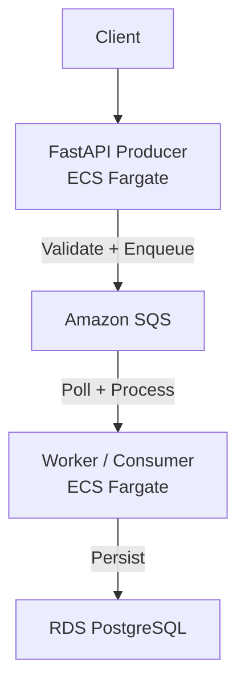

# EventGateway

Asynchronous event ingestion pipeline built with **FastAPI, Amazon SQS, ECS Fargate, and PostgreSQL**. The producer validates and queues events, while an independent worker processes them and persists the results.

**Source:** https://github.com/suzaladhikari/eventgateway

## Architecture



### Flow

1. Client sends a request to the FastAPI producer.
2. Producer validates the payload with Pydantic and sends it to SQS using `boto3`.
3. Producer returns immediately without waiting for processing.
4. Worker independently polls SQS and processes messages.
5. Worker stores the result in RDS PostgreSQL using SQLAlchemy.

## Key Design Decisions

- **SQS decoupling:** Producer and worker operate independently; messages remain queued if the worker is unavailable or overloaded.
- **Least-privilege IAM:** Producer can send to SQS but has no database permissions. Worker has permissions to consume SQS messages and access the database.
- **Async processing:** API latency is independent of database processing time.
- **Environment-based configuration:** Local `.env` and ECS environment variables use the same application configuration.

## Tech Stack

| Layer | Technology |
|---|---|
| API | FastAPI, Pydantic |
| Messaging | Amazon SQS, DLQ |
| Worker | Python, ECS Fargate |
| Database | PostgreSQL, RDS, SQLAlchemy |
| Infrastructure | Docker, ECS, ECR, IAM |
| Monitoring | CloudWatch Logs |

## Challenges & Debugging

### Import-time producer crash
An unused schema import pulled in the database module, which called `create_engine()` during import. The producer had no database configuration by design, causing the container to crash before `uvicorn` started.

**Fix:** Removed the unused database import.

### Worker configuration mismatch
The worker expected `RDS_DATABASE`, while ECS provided `DATABASE_URL`.

**Fix:** Aligned the application with the ECS environment variable.

### RDS authentication / SSL failure
The worker initially used the wrong database username and RDS rejected the connection because SSL was required.

**Fix:** Corrected the credentials and added `sslmode=require`.

All fixes were verified through ECS redeployments and CloudWatch logs. The final end-to-end test successfully processed both queued messages, with SQS depth dropping from **2 → 0**.

## Local Setup

### Docker

```bash
git clone https://github.com/suzaladhikari/eventgateway.git
cd eventgateway

cp .env.example .env
docker compose up --build
```

API docs:

```text
http://localhost:8000/docs
```

Stop:

```bash
docker compose down
```

### Without Docker

```bash
git clone https://github.com/suzaladhikari/eventgateway.git
cd eventgateway

pip install -r requirements.txt
```

Terminal 1:

```bash
uvicorn app.main:app --reload
```

Terminal 2:

```bash
python worker/consumer.py
```

> Never commit `.env` or real credentials.

## AWS Deployment

Producer and worker run as separate ECS Fargate services:

| Component | ECR | ECS |
|---|---|---|
| Producer | `eventgateway-producer` | `producer-svc` |
| Worker | `eventgateway-worker` | `consumer-svc` |

Deployment:

```text
Code → Docker Build → ECR → ECS Redeploy → CloudWatch
```

```bash
aws ecs update-service \
  --cluster eventgateway-cluster \
  --service <service-name> \
  --force-new-deployment
```

## Project Structure

```text
eventgateway/
├── app/
│   ├── main.py
│   └── schemas.py
├── worker/
│   └── consumer.py
├── Dockerfile.fastapi
├── Dockerfile.worker
├── docker-compose.yml
├── requirements.txt
├── .env.example
└── README.md
```

## Future Improvements

- AWS Secrets Manager for secrets
- Application Load Balancer for stable API access
- Automated tests and CI/CD
- DLQ monitoring and message reprocessing

## Contact

**Sujal Adhikari**

[Email](mailto:sujaladhikarids@gmail.com) · [LinkedIn](https://www.linkedin.com/in/sujaladhikari3/) · [GitHub](https://github.com/suzaladhikari)
