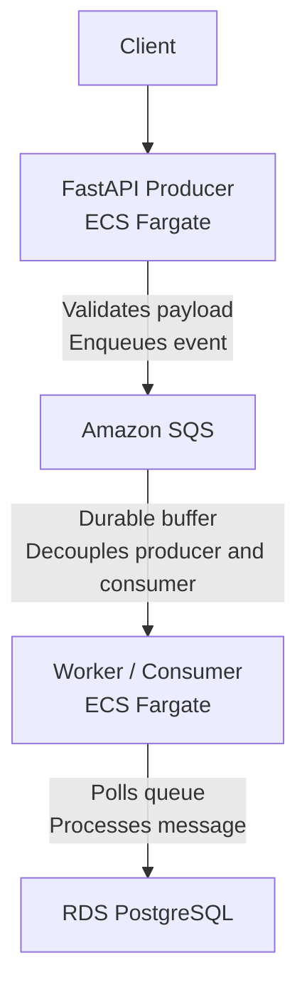

# EventGateway

Asynchronous event ingestion pipeline decoupling API request handling from data persistence, built on AWS with a FastAPI producer, SQS message queue, and independent worker service writing to PostgreSQL.

**API docs:** _(not publicly linked — see [Local Setup](#running-with-docker-recommended) or [Demo](#demo) below)_
**Source:** [github.com/suzaladhikari/eventgateway](https://github.com/suzaladhikari/eventgateway)

---

## Project Overview

EventGateway is a backend infrastructure project demonstrating how to decouple request handling from data processing using a message queue. Rather than writing directly to a database on every incoming request, a FastAPI producer validates and enqueues events to Amazon SQS and returns immediately — while a completely independent worker service polls the queue, processes messages, and persists them to PostgreSQL.

This pattern means the producer stays fast and available even if the worker is down, scaling, or slow — messages simply queue up and get processed once the worker recovers. The system also enforces least-privilege access at the infrastructure level: the producer's IAM role can only send to SQS, and has no path to the database at all, even in the event of a compromise.

---

## Architecture



### Request Flow

1. **Client sends a request** to the FastAPI producer.
2. **Producer validates the payload** against a Pydantic schema and sends the event to Amazon SQS using `boto3`. The producer returns immediately without waiting for downstream processing.
3. **SQS acts as a durable buffer**, retaining messages until they are successfully consumed or reach their configured retention period.
4. **Worker/Consumer independently polls SQS**, retrieves messages, processes them, and acknowledges successful processing by deleting them from the queue.
5. **Worker persists the final record** to RDS PostgreSQL using SQLAlchemy.

---

## Key Design Decisions

- **Decoupled producer/consumer via SQS** — The producer and worker never communicate directly. If the worker crashes, restarts, or is temporarily overloaded, the producer can continue accepting requests while messages remain queued in SQS.

- **Least-privilege IAM per service** — The producer's ECS task role is limited to the SQS permissions it needs, such as `sqs:SendMessage`. It has no database permissions. The worker's task role is granted the permissions required to consume and delete SQS messages and access the database. Separate task definitions and IAM roles limit the blast radius of a compromised service.

- **Asynchronous response pattern** — The producer responds as soon as the event has been successfully queued rather than waiting for the worker to process it. This keeps request latency independent of downstream processing time.

- **Environment-based configuration** — The application reads configuration from environment variables. Locally, variables can be loaded from `.env` using `python-dotenv`; in ECS, the same variables are supplied through the task definition. No application code branching is required between local and production environments.

---

## Tech Stack

- **Backend:** FastAPI, Pydantic
- **Messaging:** Amazon SQS, Dead-Letter Queue (DLQ)
- **Database:** PostgreSQL (Amazon RDS), SQLAlchemy
- **Infrastructure:** Docker, Amazon ECS Fargate, Amazon ECR, IAM
- **Observability:** Amazon CloudWatch Logs

---

## Challenges & Debugging

Deploying the system to ECS surfaced three distinct failures across different layers. Each issue was diagnosed using CloudWatch logs and container tracebacks rather than trial and error.

### 1. Import-time crash in the producer

A schema module contained an unused import that transitively imported the database module. The database module called `create_engine()` during module initialization, but the producer correctly had no `DATABASE_URL` because it does not access the database.

Because Python executes module-level code during imports, the application crashed before `uvicorn` could start.

**Fix:** Removed the unused database-related import from the schema module.

### 2. Environment variable mismatch in the worker

The worker code expected:

```python
os.getenv("RDS_DATABASE")
```

while the ECS task definition provided:

```text
DATABASE_URL
```

As a result, the worker received no database connection string.

**Fix:** Aligned the worker's configuration with the environment variable supplied by the ECS task definition.

### 3. RDS authentication and SSL rejection

After fixing the environment variable, the worker still could not connect to RDS. The connection string contained an incorrect master username, and the RDS instance required an encrypted connection.

**Fix:** Reset the RDS master password, corrected the database username, and added:

```text
sslmode=require
```

to the PostgreSQL connection string.

Each fix was verified in the live ECS environment by rebuilding and pushing the updated Docker image to ECR, forcing a new ECS deployment, and checking CloudWatch logs.

The final end-to-end test confirmed that the worker successfully consumed and persisted the queued messages. The SQS queue depth dropped from **2 → 0**, confirming that both messages were processed successfully.

---

## Prerequisites

- [Python 3.11+](https://www.python.org/downloads/)
- [Docker Desktop](https://www.docker.com/products/docker-desktop/)
- [Git](https://git-scm.com/)
- An AWS account with access to SQS, RDS, ECR, ECS, and IAM for cloud deployment

---

## Running with Docker

### 1. Clone the repository

```bash
git clone https://github.com/suzaladhikari/eventgateway.git
cd eventgateway
```

### 2. Configure environment variables

Copy `.env.example` to `.env` and fill in the required values:

```bash
cp .env.example .env
```

> **Note:** Do not commit `.env` or any file containing real credentials to Git.

### 3. Build and start the containers

```bash
docker compose up --build
```

### 4. Access the application

| Service | URL |
|---|---|
| FastAPI Docs | http://localhost:8000/docs |

### 5. Stop the containers

```bash
docker compose down
```

---

## Running Locally Without Docker

### 1. Clone the repository

```bash
git clone https://github.com/suzaladhikari/eventgateway.git
cd eventgateway
```

### 2. Install dependencies

```bash
pip install -r requirements.txt
```

### 3. Start the FastAPI producer

```bash
uvicorn app.main:app --reload
```

### 4. Start the worker

Open a second terminal and run:

```bash
python worker/consumer.py
```

---

## AWS Deployment

The producer and worker run as separate ECS Fargate services. Each service has its own task definition and IAM task role, with network access restricted according to its responsibilities.

| Component | ECR Repository | ECS Service |
|---|---|---|
| Producer | `eventgateway-producer` | `producer-svc` |
| Worker | `eventgateway-worker` | `consumer-svc` |

### Deployment Flow

```text
Code Change
    ↓
Docker Build
    ↓
Push Image to ECR
    ↓
Force ECS Deployment
    ↓
ECS starts new task
    ↓
CloudWatch Logs
```

After pushing a new image to ECR, force the corresponding ECS service to deploy the updated image:

```bash
aws ecs update-service \
  --cluster eventgateway-cluster \
  --service <service-name> \
  --force-new-deployment
```

---

## Project Structure

```text
eventgateway/
│
├── app/
│   ├── main.py
│   └── schemas.py
│
├── worker/
│   └── consumer.py
│
├── Dockerfile.fastapi
├── Dockerfile.worker
├── docker-compose.yml
├── requirements.txt
├── .env.example
└── README.md
```
